# Python 101: Definitions, Concepts and Examples

## How Python uses Indentation to control Flow

### In simple Terms:

Python uses indentation to control flow by defining a block of code. 

### Some Detail:

A code block starts with indentation and ends with the first unindented line. 
The amount of indentation must be consistent throughout that block. For instance, four whitespaces are used for indentation. 

### To visualize:

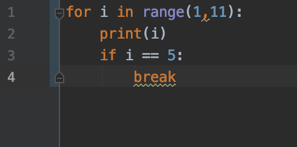

---

## Don't Repeat Yourself

### In simple Terms:

The Don't Repeat Yourself principle states that duplication in logic should be eliminated via abstraction. 

### Some Detail:

Adding unnecessary code increases the amount of work required to maintain the software in the future. Duplicate code adds to technical debt. 
Duplication decreases the quality of the code. 

### To visualize:

Calculate BMI for three subjects. 

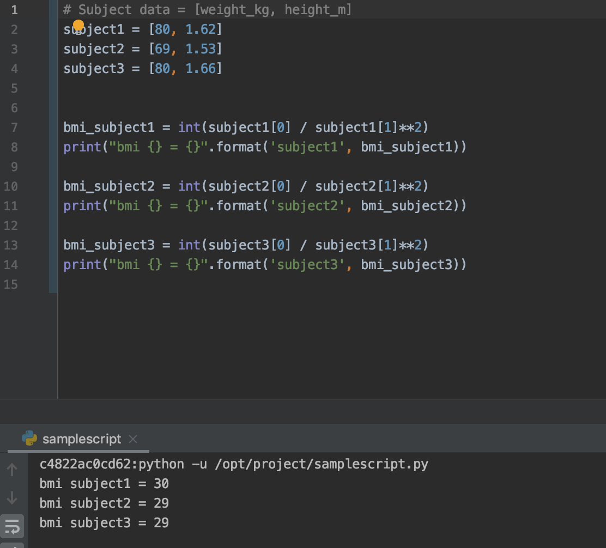

Use function to avoid repeating. 

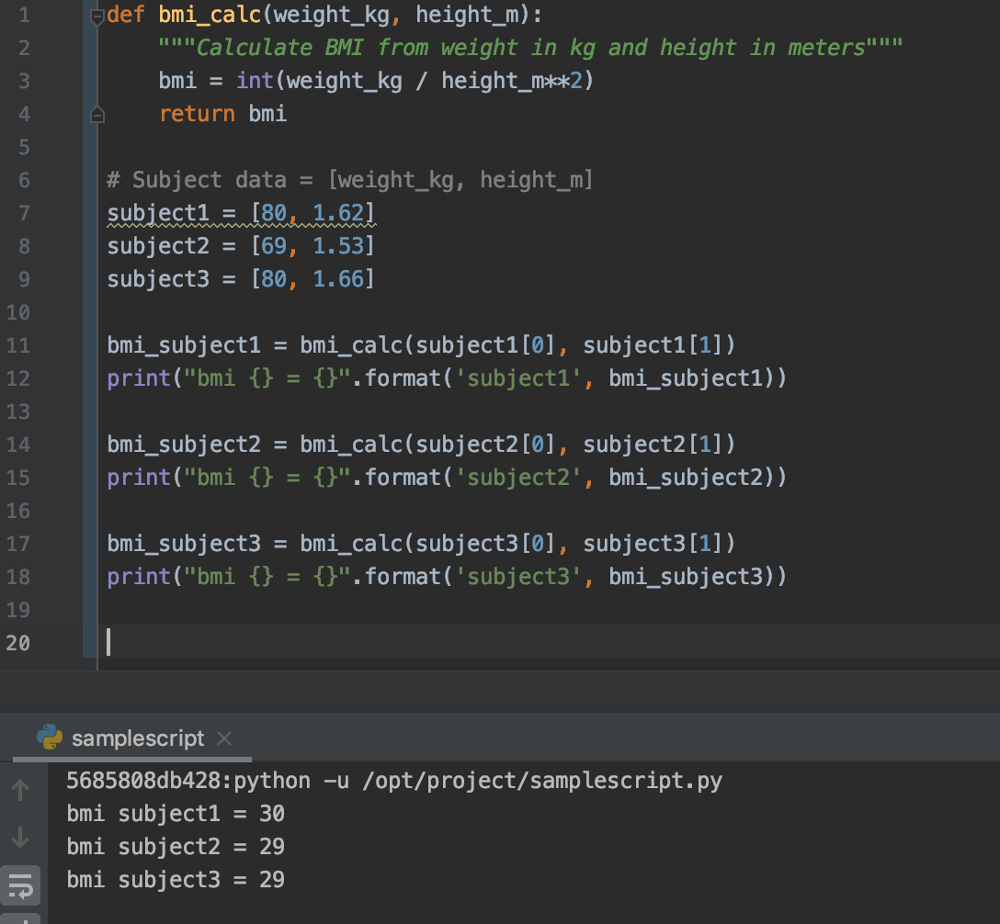

---
## Design Patterns from Gang of Four

### In simple Terms:

Programmers faced with a number of recurring problems as they write object oriented code. To standardize the solutions to these problems, four software engineers, identified the most common patterns of problems that occur in object oriented programming. They formulated model solutions to these common problems in a book called “Design Patterns: Elements of Reusable Object-Oriented Software” aka “The Gang of Four (GoF)

### Some Detail:

### Classification of Design Patterns

**Creational Patterns**: These are concerned with creating objects.

**Structural Patterns**: These patterns describe relationship between objects.

**Behavioral Patterns**: Interaction between different objects. The strategy pattern aka “The Policy Pattern" is one of the most frequently used Behavioral Pattern. The main goal of this pattern is to enable a client class to choose between different algorithms or procedures to complete the same task. 

### To visualize:

---
## Class

### In simple Terms:

Python is an object oriented programming language.
A Class is like an object constructor, or a "blueprint" for creating objects.

### Some Detail:

To create a class, use the keyword class

### To visualize:

Python Class Demo: Write a Python program to convert an integer to a roman numeral.

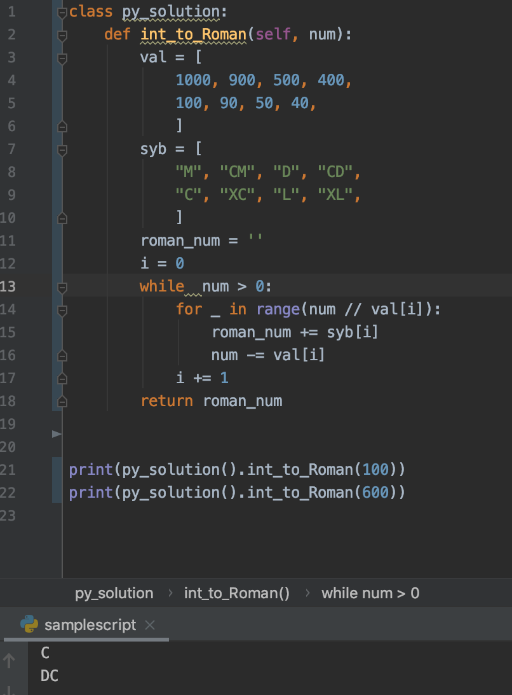
---
## Object

### In simple Terms:

Object is simply a collection of data (variables) and methods (functions) that act on those data. 

The object() function returns an empty object.

You cannot add new properties or methods to this object.

This object is the base for all classes, it holds the built-in properties and methods which are default for all classes.

### Some Detail:

Syntax: object()

### To visualize:

Create Object: we use the class named myTime to create objects. 
Create an object t1, and print the value of t. 

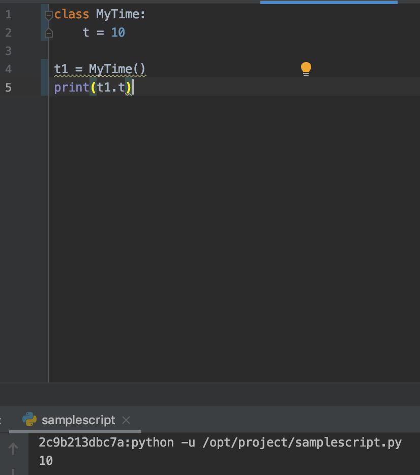
---
## Static

### In simple Terms:

Static methods do not require object creation.

A static method can always be called, but is part of a class.

Method requires you to create an object: Not the case with static methods.

### Some Detail:

Static method

Create a class and add a method. You should explicitly define it’s a static method by adding @staticmethod.

Once you defined the class, you can call the methods directly.

This calls the method without creating an object. Unlike normal class methods, they do not have access to objects variables.

### To visualize:

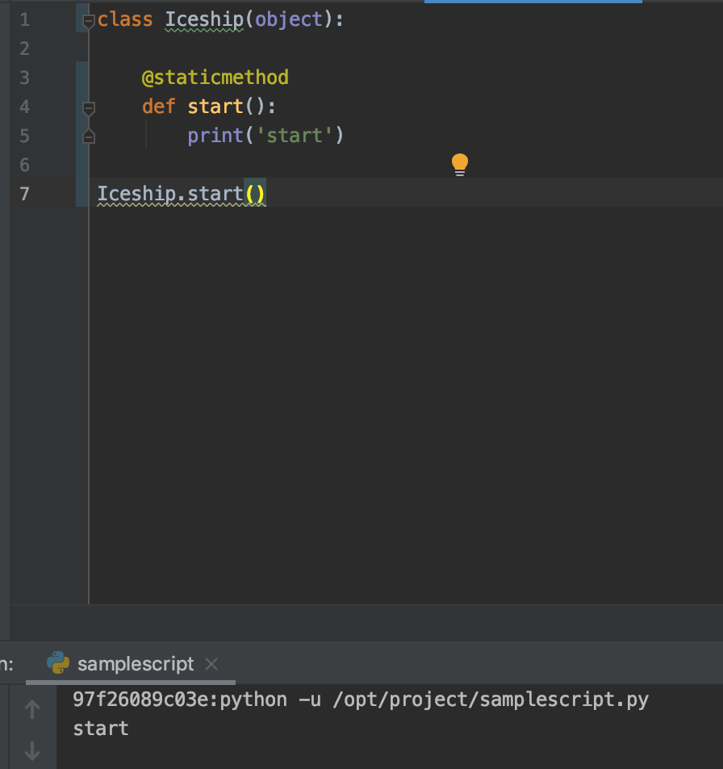
---
## Property / Attribute

### In simple Terms:

Property() function is to create property of a class. Returns a property attribute from the given getter, setter and deleter. 
If no arguments are given, property() method returns a base property attribute that doesn't contain any getter, setter or deleter.

### Some Detail:

Syntax: property(fget, fset, fdel, doc)

Parameters:
fget() – used to get the value of attribute
fset() – used to set the value of attribute
fdel() – used to delete the attribute value
doc() – string that contains the documentation (docstring) for the attribute

### To visualize:

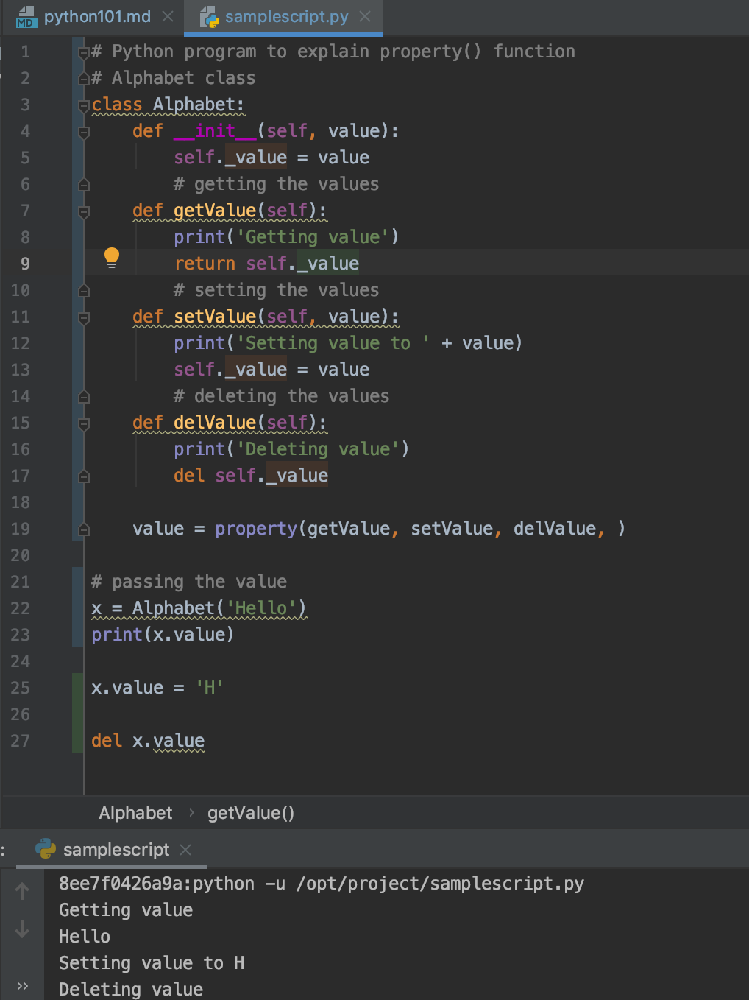
---
## Method

A Python method is similar to a Python function, but it must be called on an object. 

### In simple Terms:

To create it, you must put it inside a class. 
Now in this Car class, we have three methods, for instance, start(), speedup(), and turn(). 
In this example, let’s call the turn() Python method on blackcar. 

blackcar.turn()

## Some Detail:

The method printhello() has a name, takes a parameter, and returns a value.

### To visualize:

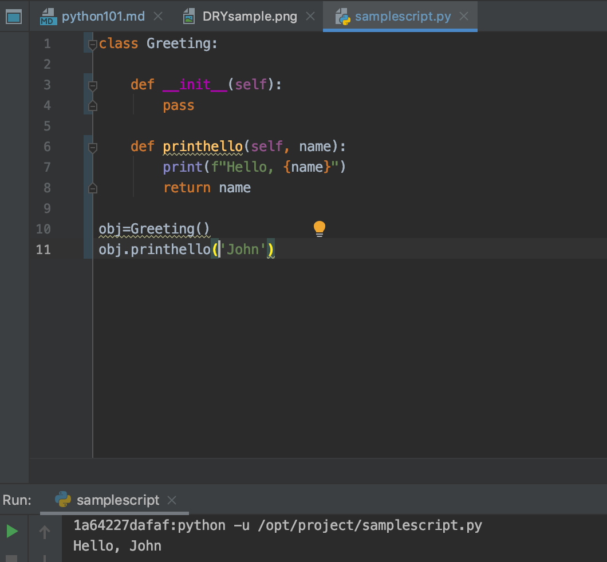

---
## Exception

### In simple Terms:

Python provides features to handle any unexpected error in your Python programs. 
Also, add debugging capabilities in them. 

An exception is an error that happens during execution of a program. When that
error occurs, Python generate an exception that can be handled, which avoids your
program to crash.

### Some Detail:

Exceptions are convenient in many ways for handling errors and special conditions
in a program. When you think that you have a code which can produce an error then
you can use exception handling.  

Below are examples of common exceptions errors in Python:

IOError
If the file cannot be opened.

ImportError
If python cannot find the module

### To visualize:
Open the file in the READ mode and then try to perform a write operation. 
For this instance, below code helps to handle the exception.

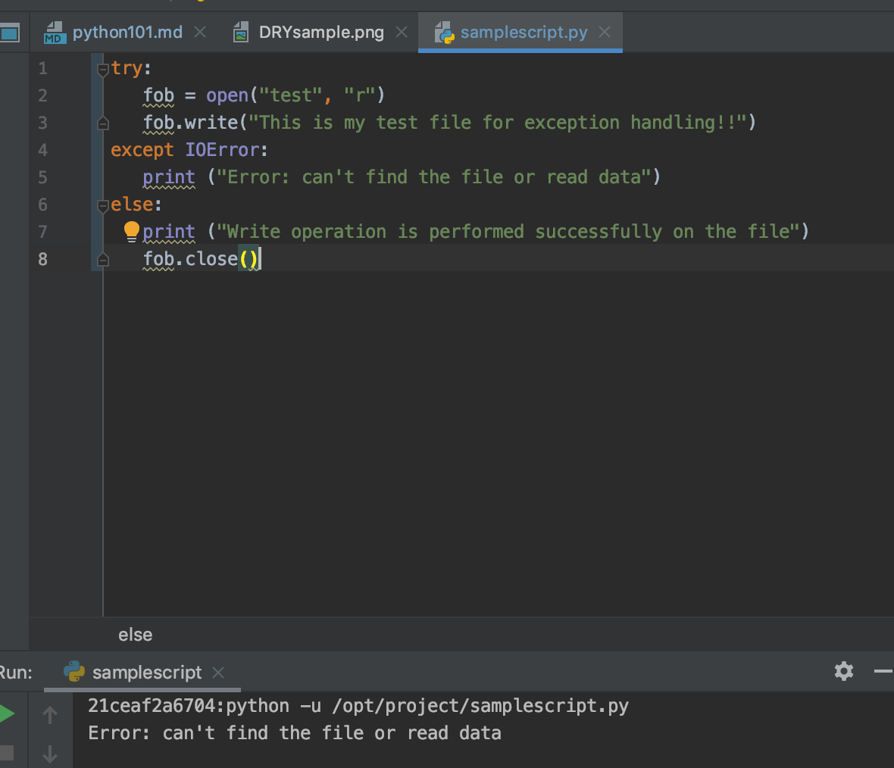

---
## Unit Test

### In simple Terms:

Unit Testing is the first level of software testing where the smallest testable parts of a software are tested.

### Some Detail:

unittest defines tests by the following two ways :

Manage test “fixtures” using code.

Test itself.

### To visualize:
This test() method will fail if TRUE is ever FALSE.

---
## Constructor

### In simple Terms:

A constructor is a method that Python calls when it instantiates an object using the definitions found in your class. 
Python relies on the constructor to perform tasks such as assigning values to any instance variables that the object 
will need when it starts. Also, constructors verify that there are enough resources for the object and perform any 
other start-up task.

### Some Detail:

The name of a constructor is always the same, __init__(). The constructor can accept arguments when necessary to create 
the object. When you create a class without a constructor, Python automatically creates a default constructor  
that doesn’t do anything. Every class must have a constructor, even if it simply relies on the default constructor. 

### To visualize:

Default constructor

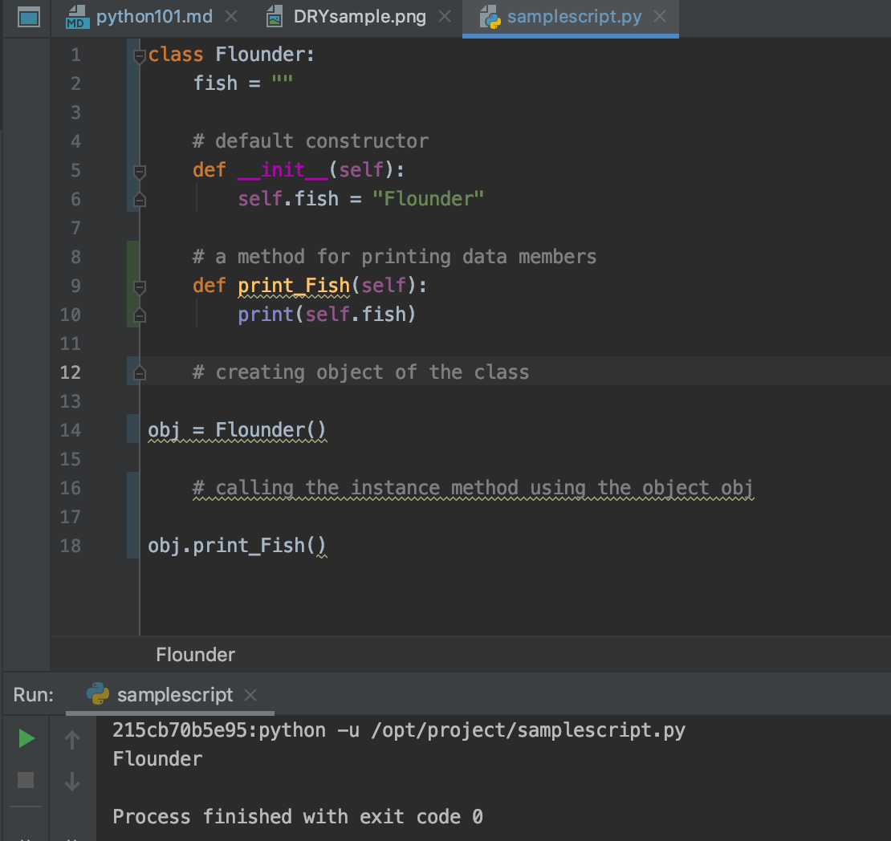

---
## Factory

### In simple Terms:
Developers may not know all objects to create in advance.
Some objects can be created only at execution time after a user requests so.
### Some Detail:

The idea is to have one function, the factory, that takes an input string and outputs an object.
The type of object depends on the type of input string you specify. This technique could make your program more easily extensible also. 
A new programmer could easily add functionality by adding a new string and class, without having to read all of the source code.

### To visualize:

The example below demonstrates a factory method. The factory method returns a new object of either type depending on the input.

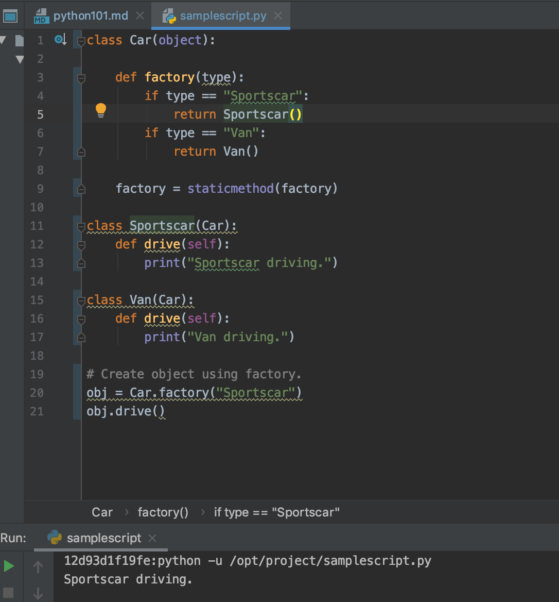
---
## Decorator

### In simple Terms:

Decorator is useful tool in Python since it allows programmers to modify the behavior of function or class. 
Also, decorator allows to wrap another function to extend the behavior of wrapped function, without permanently 
modifying it.

### Some Detail:
Method is function that expects its first parameter to be a reference to the current object. 
We can build decorators for methods the same way, while taking self into consideration in the wrapper function.

### To visualize:

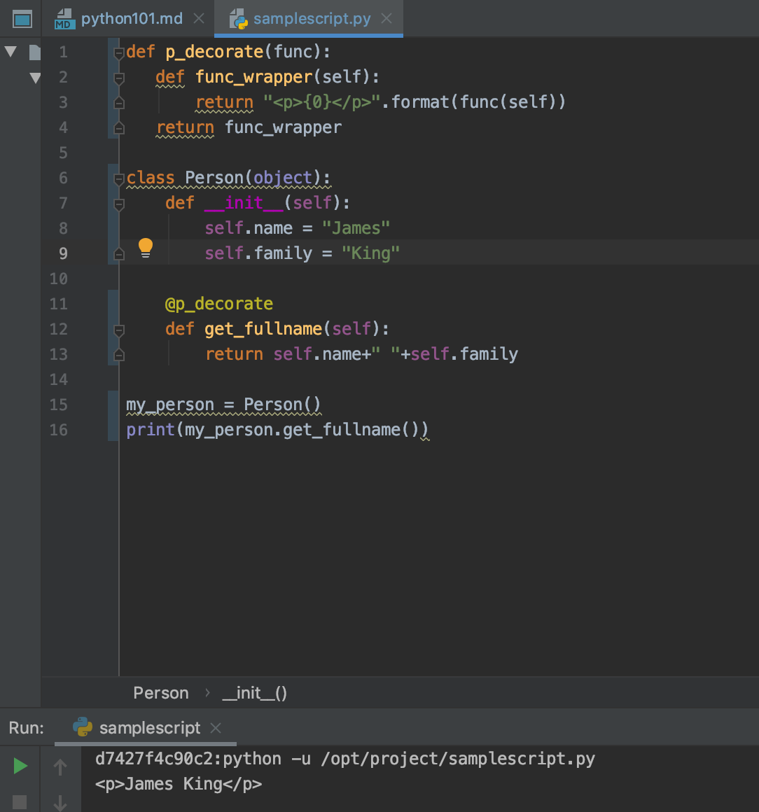
---
## Extend Class

### In simple Terms:

Extend class iterates over its argument and adding each element to the list and extending the list. 
The length of the list increases by number of elements in it’s argument

### Some Detail:

If we want to extend any existing list by concatenating the contents of any other lists to it. 
Then we should use lists’ extend() method.

### To visualize:

list.extend(anotherList)
Now contents of list1 will be extended. 

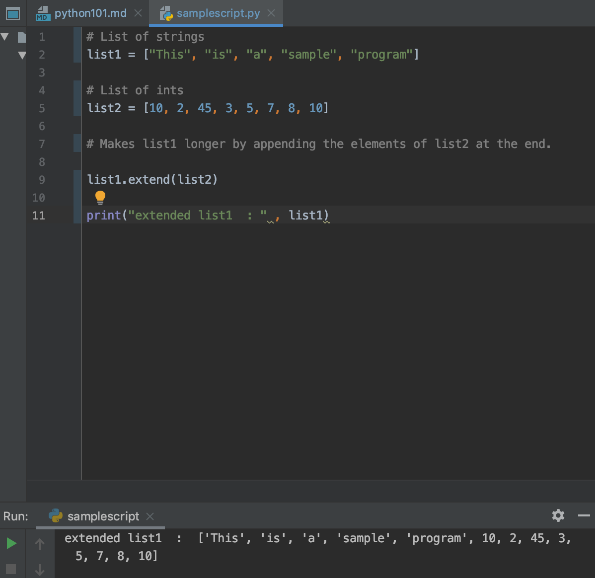

---
## CSV Files

### In simple Terms:

A CSV file (Comma Separated Values file) is a type of plain text file that uses specific structuring to arrange 
tabular data. Because it’s a plain text file, it can contain only actual text data

### Some Detail:

CSV files use a comma to separate each specific data value. Here’s what that structure looks like:

### To visualize:

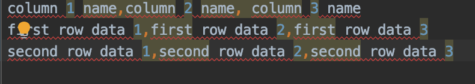

---
## Reading Files

### In simple Terms:

Reading from a CSV file is done using the reader object. The CSV file is opened as a text file with 
Python’s built-in open() function, which returns a file object. 

### Some Detail:

Each row returned by the reader is a list of String elements containing the data found by removing the delimiters. 
The first row returned contains the column names, which is handled in a special way.

### To visualize:

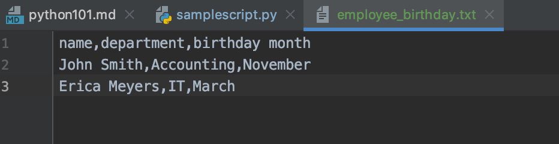
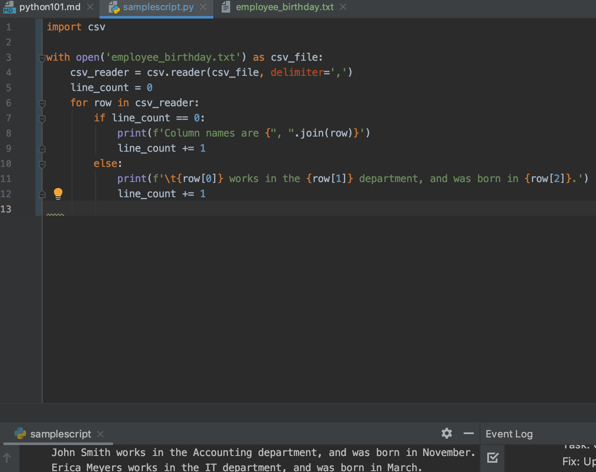

---

# Changelog

- [x] Create .md File for python 101 ~ Faisal
- [x] Added Headers for all items to be defined. ~Faisal
- [x] Added Link on README.md file ~ Faisal
- [x] How Python uses Indentation to control Flow ~Steven 
- [X] Don't Repeat Yourself ~Steven
- [X] Design Patterns from Gang of Four ~Steven 
- [X] Class ~Steven
- [X] Object ~Steven
- [X] Static ~Steven
- [X] Property / Attribute ~Steven
- [X] Method ~Steven 
- [X] Exception ~Steven
- [X] Unit Test ~Steven
- [X] Constructor ~Steven
- [X] Factory ~Steven
- [X] Decorator ~Steven 
- [X] Extend Class ~Steven
- [X] CSV Files ~Steven 
- [X] Reading Files ~Steven 

