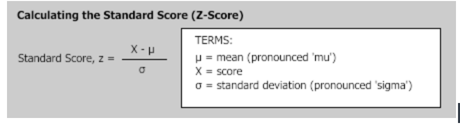
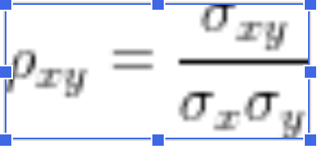
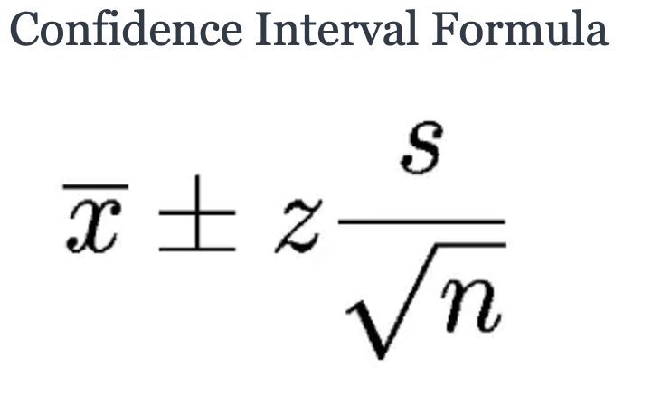

# Stat 101: Definitions & Formulas

## Population Mean

### In simple Terms:

The term population mean, which is the average score of the population on a given variable, is represented by:

μ = ( Σ Xi ) / N

### Some Detail:

The symbol ‘μ’ represents the population mean.  The symbol ‘Σ Xi’ represents the sum of all scores present in the 
population, for this case, X1 X2 and so on.  The symbol ‘N’ represents the total number of individuals or cases in 
the population.

---

## Median

### In simple Terms:

The median is the middle of a sorted list of numbers.

### Some Detail:

However, with an even amount of numbers things are slightly different.
For this case, find the middle pair of numbers, and then find the value that is half way 
between them. This is easily done by adding them together and dividing by two.

---

## Mode

### In simple Terms:

TThe mode of a data set is the number that occurs most frequently in the set. 
 
### Some Detail:

To easily find the mode, place the numbers in order from least to greatest and count how many times each number occurs.

---

## Population Standard Deviation

### In simple Terms:

The population standard deviation is a measure of the spread of the scores on a given variable 
and is represented by:
σ = sqrt[ Σ ( Xi – μ )2 / N ]

### Some Detail:

The symbol ‘σ’ represents the population standard deviation.  
The term ‘sqrt’ used in this statistical formula denotes square root.  
The term ‘Σ ( Xi – μ )2’ used in the statistical formula represents the sum of the squared deviations of the scores 
from their population mean.

## Population variance 

### In simple Terms:

The population variance is the square of the population standard deviation and is 
represented by:
σ2 = Σ ( Xi – μ )2 / N

### Some Detail:

The symbol ‘σ2’ represents the population variance.

---

## Z-Score (Standardized Score) 

### In simple Terms:

Z-scores are expressed in terms of standard deviations from their means. 
These z-scores have a distribution with a mean of 0 and a standard deviation of 1. 
The formula for calculating the standard score is given below:

### Some Detail:

The standard score is simply the score, minus the mean score, divided by the standard 
deviation.
---

## Population Correlation Coefficient

### In simple Terms:

The correlation coefficient of two variables in a data set equals to their covariance 
divided by the product of their individual standard deviations. It is a normalized 
measurement of how the two are linearly related.

### Some Detail:

The population correlation coefficient is defined as follows, where σx and σy are the 
population standard deviations, and σxy is the population covariance.

If the correlation coefficient is close to 1, it would indicate that the variables are positively linearly related and the scatter plot falls almost along a straight line with positive slope. For -1, it indicates that the variables are negatively linearly related and the scatter plot almost falls along a straight line with negative slope. And for zero, it would indicate a weak linear relationship between the variables.
 
---

## Confidence Interval

### In simple Terms:

A confidence interval (CI) is a range of values that’s likely to include a population 
value with a certain degree of confidence. It is often expressed a % whereby a population 
means lies between an upper and lower interval. Also, a confidence interval is simply a 
way to measure how well your sample represents the population you are studying.

### Some Detail:

Where:
X is the mean
Z is the chosen Z-value (1.96 for 95%)
s is the standard error
n is the sample size

---

## P Value

### In simple Terms:

All hypothesis tests ultimately use a p-value to weigh the strength of the evidence, 
in reference to the data are telling you about the population. The p-value is a number 
between 0 and 1 and interpreted in the following way:

### Some Detail:

A small p-value (typically ≤ 0.05) indicates strong evidence against the null hypothesis, so you reject the null hypothesis.
 
A large p-value (> 0.05) indicates weak evidence against the null hypothesis, so you fail to reject the null hypothesis.
 
p-values very close to the cutoff (0.05) are considered to be marginal (could go either way). Always report the p-value so your readers can draw their own conclusions.
 
---

## Proportion

### In simple Terms:

A proportion refers to the fraction of the total that possesses a certain attribute.

---

## Sample Mean 

### In simple Terms:

The sample mean is the average score of a sample on a given variable and is represented by:
x_bar = ( Σ xi ) / n

### Some Detail:

The term “x_bar” represents the sample mean.  The symbol ‘Σ xi’ used in this formula 
represents the sum of all scores present in the sample, for this case, x1 x2 and so on.  
The symbol ‘n,’ represents the total number of individuals or observations in the sample.

---

## Sample Standard Deviation

### In simple Terms:

The statistic called sample standard deviation is a measure of the spread of the scores in the sample 
on a given variable and is represented by:
s = sqrt [ Σ ( xi – x_bar )2 / ( n – 1 ) ]

### Some Detail:

The term ‘Σ ( xi – x_bar )2’ represents the sum of the squared deviations of the scores 
from the sample mean.

---

## Sample Variance 

### In simple Terms:

The sample variance is the square of the sample standard deviation and is represented by:
s2 = Σ ( xi – x_bar )2 / ( n – 1 )

The symbol ‘s2’ represents the sample variance.

---

# Changelog

- [x] Create .md File for stat 101 ~ Steven
- [x] Added Headers for all items to be defined. ~Steven
- [x] Added Link on README.md file ~ Steven
- [x] Population Mean ~Steven 
- [X] Median ~Steven
- [X] Mode ~Steven 
- [X] Population Standard Deviation ~Steven
- [X] Population Variance ~Steven
- [X] Z Score (Standardized Score) ~Steven
- [X] Population Correlation Coefficient ~Steven
- [X] Confidence Interval ~Steven 
- [X] P Value ~Steven
- [X] Proportion ~Steven
- [X] Sample Mean ~Steven
- [X] Sample Standard Deviation ~Steven
- [X] Sample Variance ~Steven 
